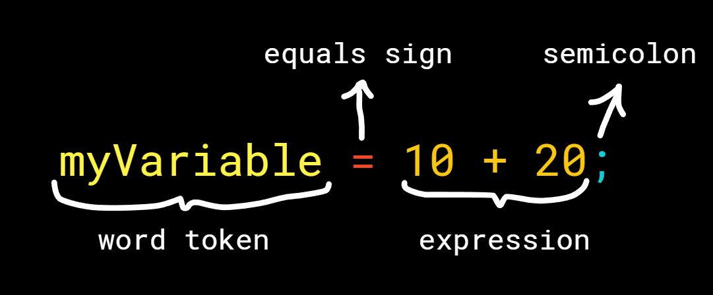

# florium

This is a library that lets you make your own programming language that can be compiled to machine code!

# Installing

Type this to install the package:

```shell
npm install florium
```

# Tokenizing

Tokenizing is basically splitting your text code into pieces that mean something;
something like integers, words, strings, comments, symbols etc.

This is super easy to do because all these come out of the box!

## Example:

```js
import {Tokenizer, CharacterList} from "florium";

const myTokenizer = new Tokenizer();

myTokenizer.add(
    // "//" is the text that will start the comment and it will end with "\n"
    buildCommentTokenizer({
        "//": "\n"
    }),
    // introduce the symbolic tokens
    buildSymbolTokenizer({
        "=": "set",
        "(": "open-parenthesis",
        ")": "close-parenthesis",
        "[": "open-square-bracket",
        "]": "close-square-bracket",
        "{": "open-curly-brace",
        "}": "close-curly-brace",
        ";": "semicolon",
        "\n": "line"
    }),
    buildRepeatingTokenizer({
        type: "string",

        // so our strings can start with either ' or "
        start: ["'", '"'],

        // this means our string ends with the thing it started with
        end: [".start"],

        // this allows you to do things like this: " I can do this: \" "
        escape: ["\\"],

        // this means it will throw an error if the string isn't closed and the file is over
        fileEndThrow: true
    }),
    // a basic definition of an integer is (anything from 0 to 9) repeating
    buildBasicRepeatingTokenizer("integer", CharacterList.Integer),
    // a basic definition of a word is (anything from a to z and A to Z) repeating
    buildBasicRepeatingTokenizer("word", CharacterList.Word),
    // these characters will be ignored
    buildIgnorantTokenizer([
        " ", "\t", "\r"
    ])
);
```

# Using the tokenizer

You can use the tokenizer right away with the `tokenize` function:

```js
import {Tokenizer} from "florium";

const myTokenizer = new Tokenizer();

// assuming you added your tokenizers

const code = "...";

console.log(myTokenizer.read(code));
```

# AST (Abstract Syntax Tree)

After tokenizing your code, you will want to convert a series of tokens into
even more meaningful things like defining variables, if statements, for loops,
while loops, function definitions, function calls etc.

In this case, the library gives you have a couple options!

Let's just make a syntax that adds variable definition.

First, let's realise what variable definitions actually are:



As you can see what actually is happening is, it's following these instructions:

- First find a word token
- Now assure that it has an equals sign after it
- Now assure that there is at least 1 thing after that, which isn't a semicolon
- Now continue collecting all tokens until it hits a semicolon

And that's it!

Now that we know what actually is going on, let's code it!

## Syntax Language

The explained 4 instructions in the previous header can be done like this
in the syntax language:

```
label:name,type:word  =  label:expression,type:*,min:1,max:infinity  ;
```

Okay, now let's see what this syntax means:

### label:name,type:word

First, let's realise that terms are separated by a space so that's why
this is the first term.

Second, let's realise that every term's instruction is separated by a comma.

Which means that the current term's label is `name` and the type we expect is
`word`! Great!

This means when the job is done, it will assign `.name` to this `Token`.

### = and ;

I'm pretty sure this one is quite clear, it just expects that character.

### label:expression,type:*,min:1,max:infinity

This part is probably the part where you went "Woah, wait a minute!".

Let's dive right into it, first as you can see it's labeled as the expression.

Second, as you can see the type is set to `*` which means **anything** can be here!

And lastly, min and max determines how many things can we have here, which has
a minimum of 1 and maximum of, well, infinity.

### The more you know!


You can negate the instruction term by putting a `!` at the beginning of the
instruction term. Example:

- `type:word` means it has to be a word
- `!type:word` means it can be anything except for a word

You can recursively call the AST:

- Why? Because let's say you have a variable definition:
- `a = 10 + (b = 10)`
- You would expect it to run the instructions on the expression that sets the value
  of the a, which is `10 + (b = 10)`.
- Well you can do this by using the `job` or `jobAll`(they are different).
- Usage: `:word`

There are aliases to everything! Here's a list:

- `type:word` = `t:word` = `:word` - Determines the type of the token
- `value:anything!` = `v:anything!` = `anything!` - Determines the value of the token
- `end:` = `#:` - This will pass if there are no tokens left in the current group
- `space:` = `s:`(confused face) - This puts a space( )
- `colon:` = `d:`(smiley face) - This puts a colon(:)
- `comma:` = `c:`(happy face) - This puts a comma(,)
- `line:` = `n:`(talking face) - This puts a line break(\n)
- `min:10` = `>:10` = `>=:10` - This determines what is the minimum number of the
  current token there has to be in order to validate the current instruction
- `max:10` = `<:10` = `<=:10` - This determines what is the maximum number of the
  current token there has to be in order to validate the current instruction
- `label:anything` = `l:anything` - Determines where the current instruction term
  will be saved in the result AST

## Using the Syntax Language with a file

This option of AST depends on a file. Let's first start by creating that
file! Name it anything you want, it can be something like `language.syntax`

Every line of this file will be considered as a syntax of your language.

You can import your syntax file like this:

```js
import {AST} from "florium";

AST.fromFile("./language.syntax");
```

### Defining the AST definition

You can define your AST by using the `@label` key:

```
@label: MyAST
```

### Adding instructions

You can add instructions like this:

```
@label: MyAST

echo: echo label:text,type:string;
```

### Pushing instructions through ASTs

You can use the `@push` key to do this:

```
@label: MyEchoAST

echo: echo type:string;


# now it's switching to another AST
@label: MyNewAST

print: print ( type:string )

# this pushes all instructions of MyEchoAST to MyNewAST 
@push: MyEchoAST
```

### Using comments

If the line is empty or starts with the character `#`, it will be ignored.

Example:

```
# I have serious comments >:c
```

## Using the Syntax Language in code

Same rules apply.

```js
import {AST, ASTSyntax} from "florium";

const ast = new AST("MyAST");

ast.syntaxes.push(
    ASTSyntax.fromText(
        "print",
        `print ( type:word )`
    )
);
```

## Using the API

Same rules apply.

```js
import {AST, ASTSyntax} from "florium";

const ast = new AST("MyAST");

ast.syntaxes.push(
    new ASTSyntax("create_variable")
        .type("word", o => o.labelAs("name"))
        .type(["set", "set-add", "set-subtract", "set-multiply", "set-divide", "set-modulo"])
        .any(o => o
            .labelAs("expression")
            .min(1).max(Infinity)
            .assignJob("ExpressionAST")
        )
        .type("semicolon")
);
```

# Using the AST

Important: You have to **first** add your tokenizers to your `Tokenizer` class
then run the AST!

Now you can run the AST by using the `.read(code: string)` function.

Usages:

```js
import {tokenize, groupTokens} from "florium";

const myAst = new AST;

// set up your ast and tokens

const code = "...";

console.log(myAst.read(code), myTokenizer);

console.log(myAst.read(code, myTokenizer.read(code)));

console.log(myAst.read(code, groupTokens(myTokenizer.read(code)), false));
```